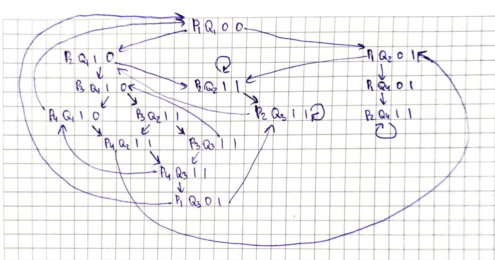

# Анализ возможных исполнений

В рамках данного задания вы проанализируете все возможные исполнения указанной ниже программы 
в модели чередования операций.

```
shared int a = 0, b = 0

== Thread P: ==
while true:
  1: a = 1
  2: while b != 0: pass // do nothing
  3: pass // critical section, do nothing
  4: a = 0

== Thread Q: ==
while true:
  1: b = 1
  2: if a == 0: break // to line 4
  3: b = 0
4: stop // outside of loop
```

Чтения и записи разделяемых переменных *a* и *b* происходят атомарно.

## Задание

Нарисуйте диаграмму всех возможных различных состояний исполнения программы из двух потоков **P** и **Q** в модели 
чередования операций и запишите результат в файл [solution.txt](solution.txt) использую следующую нотацию:
 * Состояния системы обозначаются `[Px,Qy,a,b]` где `x` это строчка когда потока **P**, `y` строчка кода потока **Q**,
   `a` это значение в переменной a, `b` значение в переменной b. Например, начальное состояние обозначается как
   `[P1,Q1,0,0]`. 
 * Каждая строка в файле должна описывать возможный переход системы и иметь вид `<state1> -> <state2>`. Например, 
   исполнение первой строки потока **P** в начальном состоянии записывается как `[P1,Q1,0,0] -> [P2,Q1,1,0]`.
 * Можете писать комментарий после символа `#`.     
 * **В первой строке файла впишите вашу фамилию и имя**.
 
Для проверки корректности вашего решения запустите `./gradlew build` из корня репозитория. 

Обратите внимание, что поток **P** никогда не останавливается, поэтому в этой системе не будет конечного
состояния. Из любого состояния есть, как минимум, переход в котором шаг делает поток **P**. 

Самостоятельно проанализируйте полученные результаты: 

* Так как каждый поток может быть в одном из 4-х состояний, а переменные *a* и *b* в одном из 2-х состояний, 
  то теоретически возможны 4 x 4 x 2 x 2 = 64 состояния. Сколько различных достижимых состояний у вас получилось?
* Возможна ли ситуация, при которой поток **P** находится в состоянии *P3* (critical section) в то время, как поток 
  **Q** находится в состоянии *Q4* (завершил выполнение)? Попробуйте объяснить это наблюдение.
* Верно ли, что из любого состояние системы достижимо состояние *Q4*, при котором поток **Q** завершил выполнение? 
  Почему так?


## Диграмма состояний

